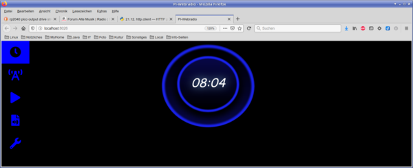

Pi-Webradio
===========

This project provides the software for a Linux-based internet-radio. While
it will run on any Linux-system (given that it has a valid sound-output),
the target-hardware is the Raspberry-Pi range.

The software has the following components:

  - mpg123 as the low-level player
  - a set of Python3-classes for control and management
  - a [web-API](doc/API.md) for (remote) control
  - a [web-GUI](doc/web-gui.md)
  - a [commandline client](doc/webradio_cli.md)
  - an integrated [client for Pirate-Audio-Hats](doc/pirate-audio.md)

Although the webradio can be controlled from any browser, it is also
possible to implement other clients by just using the [web-API](doc/API.md)
directly. The [commandline client](doc/webradio_cli.md) or the
[client for Pirate-Audio-Hats](doc/pirate-audio.md)
can be used as examples. In the latter case the server and client usually
run on the same system.

[The second part of this project](integrated/README.md) is about building
an integrated webradio using a Waveshare 7.9" touch-display. Here the
server-part of the software runs on the same machine (Raspberry Pi4)
as the web-gui. This subproject can serve as a blueprint for other
similar solutions, e.g. with the official 7"-touchdisplay for the Pi.

Note this project is work in progress. See [here](#Status "Status") for
what is already implemented.

Documentation
-------------

Documentation is a part of this Github-project:

  - [Installation](#Installation "Installation")
  - [System setup](doc/system.md)
  - [Configuration](#Configuration "Configuration")
  - [Usage](doc/pi-webradio.md)
  - [Web GUI](doc/web-gui.md)
  - [Commandline client](doc/webradio_cli.md)
  - [Using Pirate-Audio Hats](doc/pirate-audio.md)
  - [API](doc/API.md)

Note: not all planned documentation might be available/complete yet.

Installation
------------

As a prerequisite, you should have a clean install of PiOS. From a
performance perspective, a Pi-Zero-W with the lite-version of the OS
is all you need. You can install it on a desktop-system as well, e.g.
if you intend to run the web-frontend on the same machine. In
this case you must deinstall pulseaudio (be careful if you intend to
run the software on a non-dedicated system, here you might need
pulseaudio because of your audio-setup).

To install the software, run

    #sudo apt-get -y remove pulseaudio
    git clone https://github.com/bablokb/pi-webradio.git
    cd pi-webradio
    sudo tools/install [username]

If you don't supply a username, the service is installed for the
standard user "pi". As described above the first statement is only
necessary on PiOS-desktop.

For non-Debian based systems you need to adapt the installation script.

To test the installation, you can run the following commands:

    pi-webradio.py -l    # list channels
    pi-webradio.py -p 5  # play channel, use CTRL-C to finish
    pi-webradio.py -h    # help

The first should list the currently configured radio-stations, the
second one should play channel 5. Further information can be found
in the [documentation](doc/pi-webradio.md).

If testing is ok, you should activate the service (unless you only want
to use the [client](doc/webradio_cli.md)).
Enable and start the service with

    sudo systemctl enable pi-webradio.service
    sudo systemctl start  pi-webradio.service

Once the service is running, you can access the web-interface with the
url `http://<ip-or-hostname>:8026/`. If you installed the service on a
Pi-desktop system, you would use `http://localhost:8026/` from your
(local) browser.

Configuration
-------------

The central configuration-file is `/etc/pi-webradio.conf`. The file
documents the defaults. Here you can change the port or various
directories (e.g. for recordings).

Channel-configuration is in the file `/etc/pi-webradio.channels`. This
file is a json-file, with name, url, and filename (without path) of
the channel-logo. The sample channel-file distributed with the project
contains a number of radio-stations mainly from Germany.

This project does not distribute any logos for the sample channel list
to prevent any copyright-trouble. Please download the files yourself
and copy them to the `files/usr/local/lib/webradio/web/images` directory
(before installation, afterwards use the same path without the
`file`-prefix). The image-size should be about 256x256 pixel.

Finding the correct urls for your favorite radio-stations is not always
simple, there are various portals which can serve as a starting point.
If they don't disclose the url directly, you can always use the
developer-tools of your browser and check all requested urls in the
network-tab. Look for `mp3`, `m3u`, `icecast` or `shoutcast` in the
list of urls (but beware, this is only a hint, not a necessity).

Status
------

The current stable version is _0.95_. New versions will be available as soon
as they are stable.

  * 0.90: stable core, Web-GUI with basic functions
  * 0.91: GUI: add toast-messages
  * 0.92: cli: fully functional
  * 0.93: GUI: state changes synced across web-clients
  * 0.94: player API partly implemented
  * 0.95: ***player: API functional***
  * 0.96: GUI: player with basic functions
  * 0.97: player API complete
  * 0.98: GUI: player complete
  * 0.99: code cleanup
  * 1.00: API frozen
  * 1.01: IR-app (map IR-codes to web-API)

SW-Versions
-----------

The install script installs the current version from the available
repositories (Raspberry Pi or pip). Additional software distributed
with this project:

  - jquery 3.6.0 (<https://jquery.com/download>)
  - Fontawesome-free 5.13.3 (<https://fontawesome.com>)
