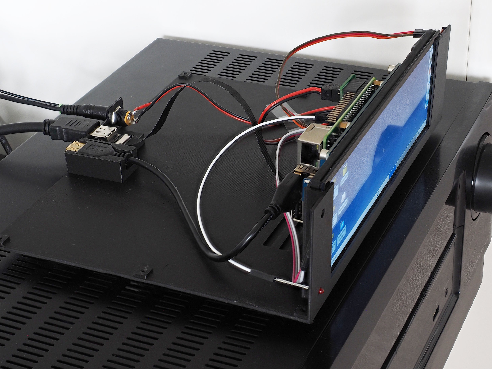
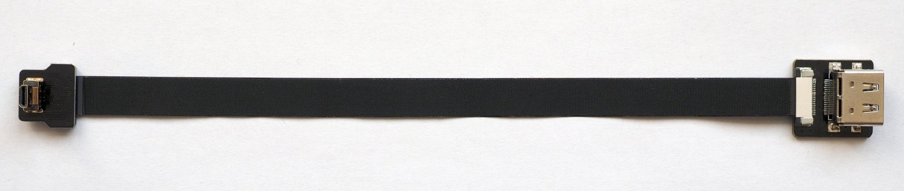

Building a nice case for the Webradio
=====================================

Besides creating the webradio-software, I wanted to build a radio
for the living-room, attached to my AV-receiver. The basis for this
project is a
[Waveshare 7.9" 1280x400 display](https://www.waveshare.com/wiki/7.9inch_HDMI_LCD)
which is ideal for a nice control panel.

The display allows to attach a Raspberry Pi on the back-side. I'm using
a Raspberry Pi4. The screen is connected to HDMI0, while the sound is
routed via HDMI1 to the AV-receiver.

Housing
-------

The housing is printed in two parts. The bottom part has sort of a pocket
on the front-side for the display, and three connectors on the back for
an USB-socket, an HDMI-socket and a 5.5/2.1mm barrel-jack for power.

On the front there is a LED, an IR-receiver and a touch-sensor. All of
these are connected to a small pcb, which also has a connector for the
power, see <https://github.com/bablokb/pcb-power-connect>.

The USB-socket is a standard, but short male-female USB-cable. For HDMI, I
used a special DIY-cable with an angled micro-HDMI connector on one
side and a normal HDMI socket on the other side:

The top of the case has pockets for 2.5mm threaded inserts from Ruthex, 
so the case can be simply screwed together. Additional stands ensure
proper ventilation.

All models are available from the [3D-directory](../3D/Readme.md).

Configuration
-------------

The necessary settings in `/boot/config.txt` to make the display work
are mainly from the Waveshare-wiki with some additions for the special setup:

    [pi4]
    #dtoverlay=vc4-fkms-v3d
    max_framebuffers=2

    [all]
    max_usb_current=1
    dtparam=audio=on
    gpu_mem=128

    # configure GPIO3 as shutdown-button
    dtoverlay=gpio-shutdown

    # configure GPIO4 for IR
    dtoverlay=gpio-ir,gpio_pin=4

    # use external status LED (GPIO17: output, drive-high)
    gpio=17=op,dh

    [HDMI:0]
    # Changes for Waveshare display
    hdmi_group=2
    hdmi_mode=87
    hdmi_timings=400 0 100 10 140 1280 10 20 20 2 0 0 0 60 0 43000000 3
    display_rotate=3

    [HDMI:1]
    hdmi_group=1
    hdmi_drive=2
    hdmi_force_hotplug=1
    hdmi_ignore_edid=0xa5000080
    hdmi_force_edid_audio=1
    hdmi_ignore_cec_init=1
    config_hdmi_boost=4

The `display_rotate`-option only rotates the output, not the touch
input. For rotation of the input you need to modify the file
`/etc/X11/xorg.conf.d/40-libinput.conf`:

    Section "InputClass"
            Identifier "libinput touchscreen catchall"
            MatchIsTouchscreen "on"
    #  0    Option "CalibrationMatrix" "0 1 0 -1 0 1 0 0 1"
            Option "CalibrationMatrix" "0 1 0 -1 0 1 0 0 1"
    #180    Option "CalibrationMatrix" "-1 0 1 0 -1 1 0 0 1"
    #270    Option "CalibrationMatrix" "0 -1 1 1 0 0 0 0 1"
            MatchDevicePath "/dev/input/event*"
            Driver "libinput"
    EndSection

Autostart of the browser
------------------------

In this setup, the Pi4 is server and client at the same time. The server
part of the software has to be installed as described in the toplevel
Readme. To automatically start the client (i.e. the web-browser),
create a "desktop"-file (e.g. `webradio_chrome.desktop`)
with the following content

    [Desktop Entry]
    Name=Pi-Webradio
    Comment=Webclient (chrome) for Pi-Webradio
    Exec=/usr/local/bin/webradio_chrome.sh
    Terminal=false
    Type=Application
    StartupNotify=false
    X-GNOME-Autostart-enabled=true

and put it into the directory `$HOME/.config/autostart`. This file
is part of the distribution in the `misc`-directory.
