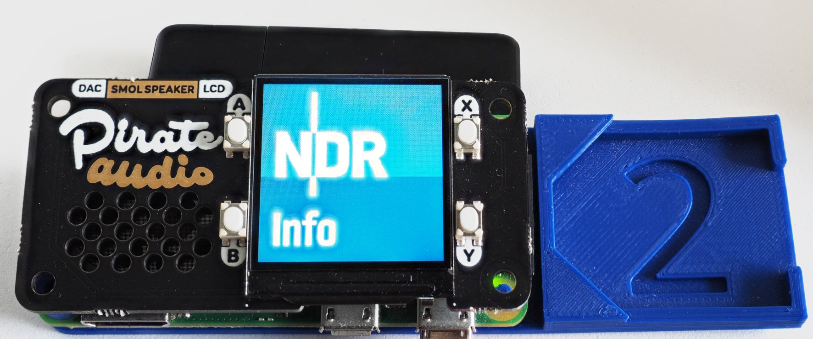

Configuring a Pirate-Audio-Hat for Pi-Webradio
==============================================

Pimoroni has a number of Pi-Zero audio-hats, they all have four buttons
and a 240x240 display. Depending on your need, you can buy a version
with a speaker or headphone-jack or line-out terminals.

On these hats you can run the server and a special client which
controls the keys and the screen.

System Setup
------------

Use `tools/install-pirate-audio` for automatic system-setup. The
script installs these software packages:

  - apt: python3-rpi.gpio python3-spidev python3-pil python3-numpy
  - pip: st7789

and adds the following entries to `/boot/config.txt`:

    # enable spi
    dtparam=spi=on

    # turn off default BCM-audio
    dtparam=audio=off
    
    # activate DAC
    pio=25=op,dh
    dtoverlay=hifiberry-dac
    
    #key-mapping: A->up, B->down, X->right, Y->left
    #              5       6       16        24
    dtoverlay=gpio-key,gpio=5,keycode=103,label="UP"
    dtoverlay=gpio-key,gpio=6,keycode=108,label="DOWN"
    dtoverlay=gpio-key,gpio=16,keycode=106,label="RIGHT"
    dtoverlay=gpio-key,gpio=24,keycode=105,label="LEFT"

Note that on older versions of the hat the Y-key is connected to
GPIO20. In this case, remove the last line, don't map GPIO20, since
this interferes with PCM.

Software Setup
--------------

Run a standard installation of pi-webradio. Then enable and start
the client:

    sudo systemctl enable pi-webradio-pirate-audio.service
    sudo systemctl start  pi-webradio-pirate-audio.service

Use the keys on the left side to change the volume and the keys on
the right side of the displays to flip through the channels.

Activate Readonly Mode
----------------------

Since the pirate-audio hat only has four buttons and they are used up
by the application, there is no shutdown key. Activating the read-only
mode for the Pi is therefore recommended.

To activate this mode, start `raspi-config`, select
"4 Performance Options" followed by "P3 Overlay File System" and then
follow the instructions. You can disable the mode in the same way.

Read-only mode has one drawback: the application can't save it's
state  anymore (e.g. current volume and current channel). Therefore,
you should configure volume and your favorite channel before activating
read-only mode.

