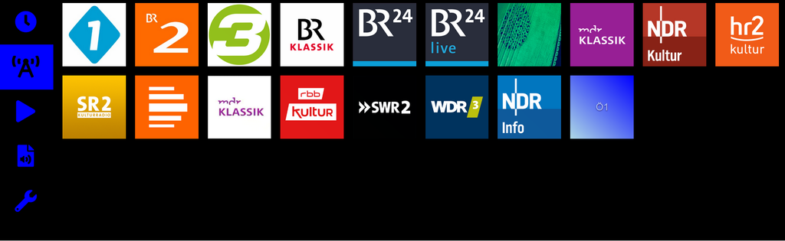
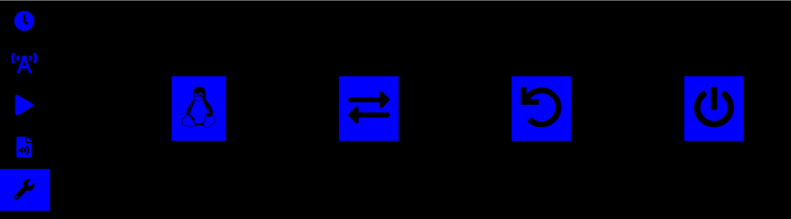

Web-GUI
=======

The web-GUI is organized in vertical tabs accessible from icons on
the left. Although the layout is responsive, it is best viewed in
landscape mode.

Each tab serves a certain purpose, e.g. channel selection or playback:

Main Page
---------

The main page shows an animated clock 
(source: <https://codepen.io/cassidoo/pen/LJBBaw>):

Channel Selection
-----------------

This is a responsive CSS3-grid of the channel-logos:

Play
----

This screen has an info-area on the right for ICY-meta infos broadcasted
together with the audio-stream. The buttons beneath the logo allow
for start/pause/stop and recording. The volume-buttons change the
volume via the playback-program (mpg123), they don't change the system-volume.

File Selection
--------------

This dialog allows navigation within a directory of mp3-files. You have
to configure the root-directory in `/etc/pi-webradio.conf`.

(This is still work in progress and not yet implemented).

System-Functions
----------------

The last tab has some buttons for stopping or restarting the application,
and for system-reboot or shutdown.

